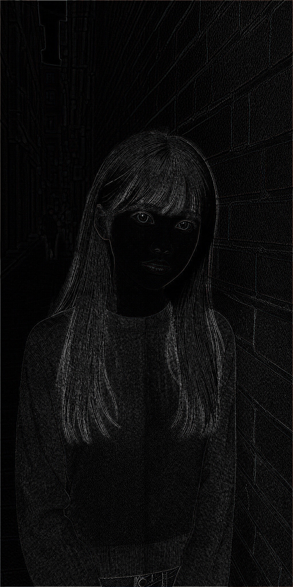
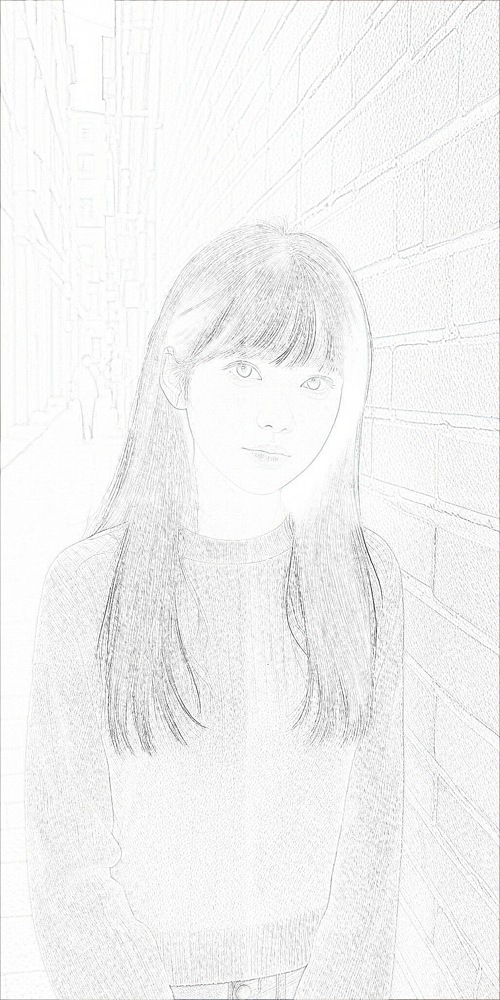
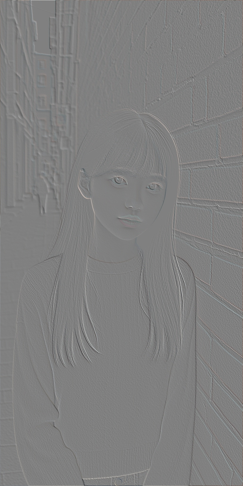
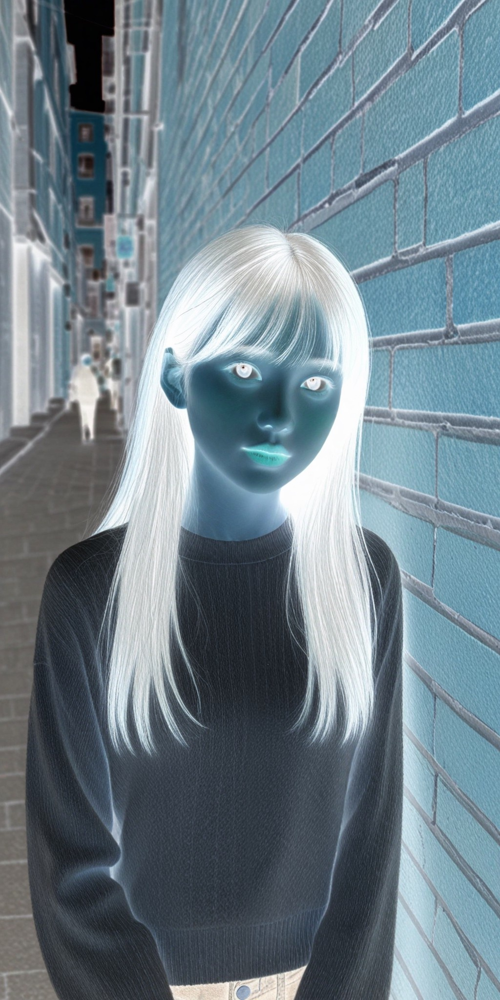

# ComfyUI PIL Nodes

PIL Nodes

## Workflow Example

[PIL图像处理DEMO.json](example/PIL%E5%9B%BE%E5%83%8F%E5%A4%84%E7%90%86DEMO.json)

## PIL TITLE (Mexx) & PIL Merge Image (Mexx)

## PIL Effects (Mexx)

### 原始

### 线稿-LINE0

### 线稿-LINE1

### 线稿-LINE2

### 线稿-LINE3

### 线稿-LINE3.1

### 线稿-LINE3.2

### 线稿-LINE4

### 线稿-LINE5

### 边缘检测-FIND_EDGES

### 轮廓-CONTOUR

### 灰度-L

### 锐化-SHARPEN

### 锐化-UNSHARP_MASK

### 边缘增强-EDGE_ENHANCE

### 边缘增强-EDGE_ENHANCE_MORE

### 浮雕-EMBOSS

### 平滑-SMOOTH

### 平滑-SMOOTH_MORE

### 细节-DETAIL

### 模糊-BLUR

### 模糊-BOX_BLUR

### 模糊-GAUSSIAN_BLUR

### 反相-INVERT

### 去燥-中值滤波器
